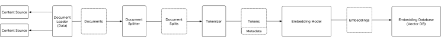

# LLMs
## RAG (Retrieval Augmented Generation):
Reason: (TODO)

### Stages
involve three stages:
-   Indexing
-   Retrieval
-   Generation

#### Stage 1: Indexing
 ##### Workflow

Load -> Transform -> Embed -> Store

1. **Loading Diverse Data Sources:**

The indexing process begins with data loaders, which act as information gatherers. They retrieve data from various sources, including unstructured documents (e.g., PDFs, docs), semi-structured data (e.g., XML, JSON, CSV), and even structured data residing in SQL databases. These loaders then convert the retrieved data into a standardized document format for further processing.

2. **Transforming Data for Efficient Processing:**

Document splitters take the stage next. Their role is crucial in organizing the data and preparing it for efficient processing by the embedding model. They achieve this by segmenting the documents into logical units – sentences or paragraphs – based on predefined rules. This segmentation ensures that information remains semantically intact while preparing it for further processing. Imagine a large research paper being fed into the system. The document splitter receives the PDF from the loader and meticulously splits it into individual paragraphs for further processing.

3. **Tokenization: The Building Blocks of Meaning:**

Following segmentation, the tokenizer steps in. It takes each logical unit (e.g., paragraph) from the document splitter and breaks it into its fundamental building blocks: tokens. These tokens can be individual words, sub-words, or even characters, depending on the chosen embedding model and the desired level of granularity. Accurate tokenization is critical for tasks that rely on understanding the meaning of the text, as it forms the basis for how the LLM interprets the information. Since the tokenizer essentially defines the vocabulary understood by the entire RAG architecture, utilizing a single shared tokenizer process across all components dealing with text processing and encoding is recommended. Using a single tokenizer ensures consistency throughout the system.

4. **Embedding: Capturing Semantic Meaning:**

Once tokenization is complete, the embedding model takes center stage. Its role is to convert each token into a numerical vector representation, capturing its semantic meaning within the context of the surrounding text. Pre-trained embedding models, either word embeddings or contextual embeddings, achieve this by mapping the tokens into these vector representations.

Finally, an indexing component takes over. It packages the generated embedding vectors along with any associated metadata (e.g., document source information) and sends them to a specialized embedding database – the vector database (vector DB) – for efficient storage. This database becomes the foundation for the retrieval stage, where the RAG architecture searches for relevant information based on user queries.

5. **The Stored Foundation:**

The vector database plays a crucial role in efficient retrieval. It stores the embedding vectors in a three-dimensional space, allowing for fast and effective search operations based on vector similarity. The embedding model paves the way for the retrieval process, where the RAG architecture efficiently locates relevant information from the indexed data based on user queries, ultimately enabling the LLM to generate informative and relevant responses.

Stage 2: Retrival
Stage 1: Indexing

## TODO: (Outline)
-   Context window
-   query transformations
-   Routing
-   Query construction
-   Indexing
-   Retrieval
-   Generation

Bibliographie:

-   https://www.linkedin.com/pulse/rag-architecture-deep-dive-frank-denneman-4lple